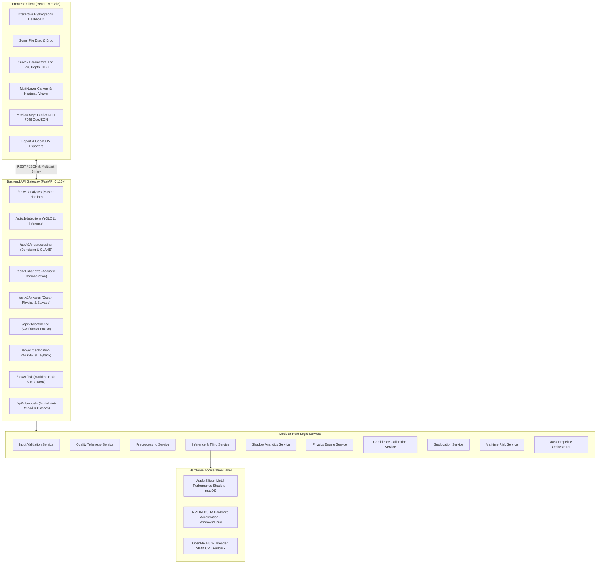

# MarineScan System Architecture Specification

MarineScan is an enterprise-grade autonomous subsea computer vision, acoustic shadow corroboration, ocean physics modeling, WGS84 geodesy, and maritime risk assessment platform. It processes raw sidescan sonar (SSS) waterfall records and ROV optical imagery into geolocated, physically validated, and risk-classified marine intelligence reports.

---

## 1. High-Level Architecture

MarineScan follows a decoupled, service-oriented architecture:



---

## 2. 7-Class Marine Detection Taxonomy

MarineScan utilizes a fine-tuned **YOLO11** deep neural network (`weights/yolo11_sonar_best.pt`, 5.20 MB) trained across 7 underwater target categories:

| ID | Class Name | Category | Risk Level | Physical Compaction ($\phi$) | Typical Density ($\rho$) | Operational Implication |
|:---:|:---|:---|:---:|:---:|:---:|:---|
| `0` | **`shipwreck`** | Maritime Vessel | **High** | $0.65$ | $1800\text{ kg/m}^3$ | Sunken steel hulls, machinery, masts; major navigational obstruction. |
| `1` | **`pipe`** | Subsea Infrastructure | **High** | $0.70$ | $7850\text{ kg/m}^3$ | Subsea oil/gas pipelines, tubular conduit; trawl snag and rupture risk. |
| `2` | **`ghost_net`** | Abandoned Fishing Gear | **Critical** | $0.25$ | $1150\text{ kg/m}^3$ | ALDFG gear; severe marine wildlife mortality, propeller and diver hazard. |
| `3` | **`marine_debris`** | Anthropogenic Waste | **Moderate** | $0.50$ | $1350\text{ kg/m}^3$ | Lost shipping containers, metal drums, plastic seafloor debris. |
| `4` | **`aircraft`** | Aerospace Wreckage | **Critical** | $0.35$ | $650\text{ kg/m}^3$ | Downed airframes, fuselage sections, flight equipment; priority salvage. |
| `5` | **`other`** | Unclassified Target | **Moderate** | $0.50$ | $1400\text{ kg/m}^3$ | Unidentified acoustic reflector or seafloor anomaly requiring human review. |
| `6` | **`fish`** | Marine Fauna | **Low** | $0.48$ | $1025\text{ kg/m}^3$ | Biological marine life, fish schools (neutrally buoyant, non-hazardous). |

---

## 3. 12-Stage Master Intelligence Pipeline

The engine executes sequentially with sub-millisecond stage telemetry:

```
                  ┌───────────────┐
                  │ Uploaded File │
                  └───────┬───────┘
                          ↓
                  1. Input validation
                          ↓
                    2. Quality check
                          ↓
                    3. Preprocessing
                          ↓
                     4. YOLO11 Inference
                          ↓
                   5. Candidate list
                          ↓
                  6. Shadow evidence
                          ↓
                 7. Physics validation
                          ↓
                 8. Confidence fusion
                          ↓
                    9. Geolocation
                          ↓
                  10. Dimension estimate
                          ↓
                  11. Risk classification
                          ↓
                     12. Final result
```

1. **Input Validation**: Magic-byte MIME verification (JPEG, PNG, WEBP, BMP, TIFF), zero-byte rejection, memory-buffered OpenCV decoding.
2. **Quality Check**: Laplacian focus variance ($\sigma^2$), RMS contrast, Signal-to-Noise Ratio (SNR dB), dynamic exposure clipping.
3. **Preprocessing**: Bilateral/median acoustic speckle denoising, CLAHE in LAB color space, precomputed gamma lookup tables (LUT), and false colormapping (`sonar_acoustic`, `turbid_water`, etc.).
4. **YOLO11 Inference**: Batched neural inference with sliding-window tiling (`predict_tiled`) and Global Non-Maximum Suppression (NMS) for extreme aspect-ratio waterfall strips.
5. **Candidate Extraction**: Generates stable candidate identifiers (`det_xxxxxxxx`) with normalized bounding coordinates.
6. **Shadow Evidence**: Directional ray alignment radiating away from nadir ground-track; hydrographic 3D elevation calculation:
   $$h = \frac{L_{\text{shadow}} \cdot H_{\text{altitude}}}{R_{\text{slant}} + L_{\text{shadow}}}$$
7. **Physics Validation**: Mackenzie (1981) speed of sound, Francois-Garrison acoustic absorption, 3D volumetric displacement, Archimedes buoyancy ($F_B$), net submerged mass, **1.5× dynamic crane hoist ratings**, and seabed hydrodynamic stability index ($S$).
8. **Confidence Fusion**: Tripartite calibrated fusion ($45\%$ AI + $35\%$ Physics + $20\%$ Quality) with dynamic turbidity noise gating and $0.55\times$ physical impossibility penalty.
9. **Geolocation & Layback**: Towfish catenary layback correction ($\sqrt{L^2 - D^2} \cdot k_{\text{catenary}}$), vessel gyro rotation, WGS84 ellipsoidal projection, Nautical DMS, UTM easting/northing, and RFC 7946 GeoJSON FeatureCollections.
10. **Dimension Scaling**: Metric length, width, shadow height, seabed footprint area, and displacement volume.
11. **Maritime Risk Assessment**: Under-keel clearance calculation ($\text{Depth} - H_{\text{object}}$) across shallow ($\le 3.5\text{m}$), medium ($\le 7.5\text{m}$), and deep ($\le 15.0\text{m}$) draft vessels; trawl net snag hazard; subsea pipeline proximity; USCG/IMO NOTMAR alerts and IHO S-57 charting directives.
12. **Result Synthesis**: Consolidates `MasterAnalysisResult`, stage latency timings, GeoJSON features, and rendered multi-layer JPEG overlays.

---

## 4. Cross-Platform Execution Architecture

MarineScan is designed to operate identically on **macOS**, **Windows**, and **Linux**:

### Compute Device Auto-Detection
The `ModelLoader` singleton detects hardware capabilities during startup:
```python
if torch.backends.mps.is_available():
    device = torch.device("mps")      # Apple Silicon (macOS M1/M2/M3/M4)
elif torch.cuda.is_available():
    device = torch.device("cuda")     # NVIDIA GPU (Windows / Linux)
else:
    device = torch.device("cpu")      # Fallback OpenMP multi-threaded CPU
```

### Filesystem & Path Compatibility
- All paths within the core service layer and CLI scripts use Python's `pathlib.Path` or `os.path.join()`.
- Windows backslash paths (`C:\path\to\weights`) and POSIX forward slash paths (`/path/to/weights`) are normalized automatically.

### Command Mappings Across Platforms

| Operation | macOS / Linux | Windows (PowerShell) | Windows (Command Prompt `cmd.exe`) |
|---|---|---|---|
| **Create venv** | `python3 -m venv venv` | `python -m venv venv` | `python -m venv venv` |
| **Activate venv** | `source venv/bin/activate` | `.\venv\Scripts\Activate.ps1` | `venv\Scripts\activate.bat` |
| **Install deps** | `pip install -r requirements.txt` | `pip install -r requirements.txt` | `pip install -r requirements.txt` |
| **Dev Server** | `uvicorn app.main:app --reload --port 8000` | `uvicorn app.main:app --reload --port 8000` | `uvicorn app.main:app --reload --port 8000` |
| **Run All 82 Tests** | `python -m unittest discover -s app/tests -p "test_*.py" -v` | `python -m unittest discover -s app/tests -p "test_*.py" -v` | `python -m unittest discover -s app/tests -p "test_*.py" -v` |
| **Model Validation** | `./venv/bin/python test_yolo11_model.py "..."` | `.\venv\Scripts\python.exe test_yolo11_model.py "..."` | `venv\Scripts\python.exe test_yolo11_model.py "..."` |
| **Pipeline CLI** | `python test_sonar.py sample_sidescan.png` | `python test_sonar.py sample_sidescan.png` | `python test_sonar.py sample_sidescan.png` |
| **Frontend Dev** | `npm run dev` | `npm run dev` | `npm run dev` |
